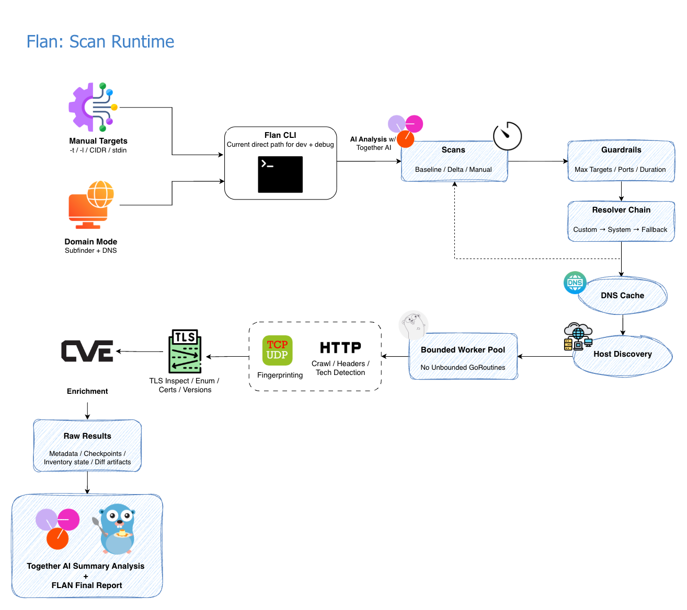
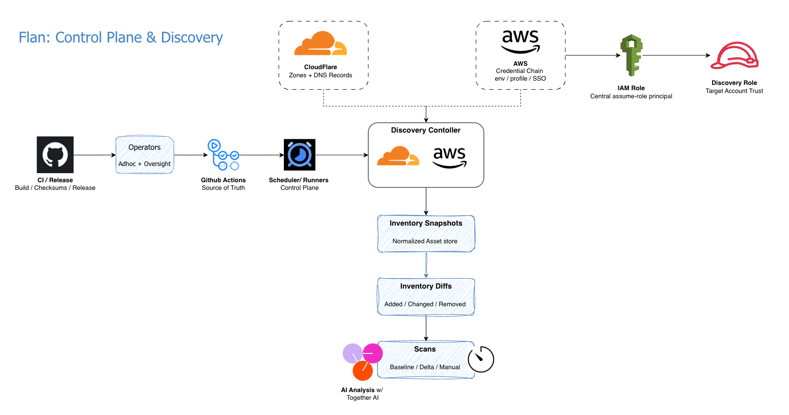

# flan

[](https://go.dev/dl/)
[](LICENSE)
[](https://github.com/therandomsecurityguy/flan-go-scan/actions/workflows/ci.yml)

Flan is a Swiss army knife network scanner in Go. Successor to [Flan Scan](https://github.com/cloudflare/flan).

## Features

- TCP port scanning with bounded concurrency
- 51-protocol service fingerprinting via [fingerprintx](https://github.com/praetorian-inc/fingerprintx) (SSH, HTTP, MySQL, Redis, RDP, PostgreSQL, and more)
- Technology detection (Wappalyzer) and CPE generation
- TLS certificate inspection (version, cipher, subject, issuer, SANs, expiry, self-signed)
- Optional strict TLS certificate verification via `--tls-verify`
- CVE lookup by CPE via NVD API
- Host discovery (TCP probe to skip dead hosts)
- Passive subdomain enumeration via 10 no-key sources (crt.sh, Common Crawl, Wayback Machine, RapidDNS, Anubis, Digitorus, HudsonRock, SiteDossier, THC, ThreatCrowd)
- CDN detection (Cloudflare) — limits scan to ports 80/443 by default on CDN hosts
- DNS enumeration with wildcard detection and custom wordlist/resolver support
- Cloudflare zone-based target discovery via `CLOUDFLARE_API_TOKEN`
- AWS asset discovery via the standard AWS SDK credential chain or `--aws-profile`
- NS, MX, TXT, CNAME record lookups
- CIDR and stdin input support
- nmap top 100/1000 port lists with expanded 2000/5000 presets
- Scan checkpointing and resumption
- Scan guardrails for large runs (`max_targets`, `max_ports_per_target`, `max_duration`)
- Progress reporting
- UDP service detection (DNS, NTP, SNMP, IPSEC) via `--udp`
- Web crawler with app fingerprinting via `--crawl` (path, header, and cookie-based detection for 60+ CMSes, frameworks, and admin tools)
- Default deeper product fingerprinting for cloud/admin/data surfaces such as Kubernetes, Grafana, Vault, Elasticsearch, PostgreSQL, Redis, LDAP, SMB, GraphQL, OpenVPN, and IPsec
- Context-aware rate limiting and TLS inspection — clean shutdown on Ctrl+C
- Graceful shutdown on SIGINT/SIGTERM
- AI-powered security analysis via [Together API](https://together.ai) (`Qwen/Qwen3.5-9B`) — brief summary on every scan, detailed report with `--analyze`
- Pretty streaming CLI output with TTY detection (JSONL when piping)
- Per-run scan metadata report (`scan-metadata-*.json`) for auditability
- JSON, JSONL (streaming), CSV, and text output
- Domain-mode output keeps subdomain and IP context (`hostname (ip):port`)
- Security header checks are evaluated on `2xx/3xx` HTTP responses; `4xx/5xx` responses are reported as skipped
- Configurable via YAML

## Architecture



## Installation

From GitHub:

```
go install github.com/therandomsecurityguy/flan-go-scan/cmd/flan@latest
```

From source (go version > 1.21):

```
git clone git@github.com:therandomsecurityguy/flan-go-scan.git
cd flan-go-scan
go build -o flan ./cmd/flan
./flan --help
```

Docker:

```
git clone git@github.com:therandomsecurityguy/flan-go-scan.git
cd flan-go-scan
docker build -t flan .
docker run --rm flan --help
docker run --rm flan -t scanme.nmap.org --json
```

## Usage

```
flan --help
```

Scan a single target:

```
flan -t scanme.nmap.org
```

Scan a domain (DNS enumeration + port scan):

```
flan -d example.com
```

Scan from a file with top 1000 ports:

```
flan -l targets.txt --top-ports 1000
```

Fingerprint already-open endpoints directly:

```
flan -t scanme.nmap.org:22 --fingerprint-only
```

Fingerprint a known database or service endpoint directly:

```
flan -t 10.0.0.15:5432 --fingerprint-only
```

High-signal platform fingerprints are surfaced automatically for common control-plane and admin surfaces, including `Kubernetes`, `Grafana`, `Vault`, `Artifactory`, `Elasticsearch`, `Consul`, `Prometheus`, `TeamCity`, and `etcd`.

Scan a CIDR range from stdin:

```
echo "10.0.0.0/24" | flan -l -
```

Scan with custom wordlist and resolver:

```
flan -d example.com -w wordlist.txt -r 8.8.8.8:53
```

Passive enumeration only (skip brute-force):

```
flan -d example.com --passive-only
```

Subdomains only output (subfinder-style, one per line):

```
flan -d example.com --subdomains-only
```

Domain scan port profile:

```
flan -d example.com --subdomain-ports web
```

Tune passive enumeration sources/settings:

```
flan -d example.com --subfinder-all --subfinder-max-time 10 --subfinder-threads 20
```

Scan all ports on CDN hosts (default is 80/443 only):

```
flan -d example.com --scan-cdn
```

Discover scan targets from Cloudflare zones:

```
flan --cloudflare --cloudflare-zones example.net --cloudflare-include api.example.net
```

Limit Cloudflare discovery to matching hostnames:

```
flan --cloudflare --cloudflare-zones example.net --cloudflare-include "api.example.net" --cloudflare-exclude "internal.example.net"
```

Print Cloudflare-discovered hostnames only:

```
flan --cloudflare --cloudflare-zones example.net --cloudflare-include "api.example.net" --subdomains-only
```

Discover scan targets from AWS:

```
AWS_PROFILE=<profile> flan --aws --aws-regions us-west-2
```

Print AWS-discovered targets only:

```
AWS_PROFILE=<profile> flan --aws --aws-regions us-west-2 --subdomains-only
```

Write a normalized AWS inventory snapshot for later diffing:

```
AWS_PROFILE=<profile> flan --aws --aws-regions us-west-2 --aws-inventory-out reports/aws-inventory.json
```

Scan only added or changed AWS targets when a previous snapshot exists:

```
AWS_PROFILE=<profile> flan --aws --aws-regions us-west-2 --aws-inventory-out reports/aws-inventory.json --aws-delta-only
```

Validate Kubernetes access from a kubeconfig:

```bash
flan --kubeconfig ~/.kube/config --kube-context prod-cluster
```

Write a normalized Cloudflare inventory snapshot for later diffing:

```
flan --cloudflare --cloudflare-zones example.net --cloudflare-include "api.example.net" --cloudflare-inventory-out reports/cloudflare-example-net.json
```

Diff the current Cloudflare inventory against a previous snapshot:

```
flan --cloudflare --cloudflare-zones example.net --cloudflare-include "api.example.net" --cloudflare-inventory-out reports/cloudflare-example-net.json --cloudflare-diff-against reports/cloudflare-example-net-prev.json
```

Scan only added/changed Cloudflare hosts when a previous snapshot exists:

```
flan --cloudflare --cloudflare-zones example.net --cloudflare-include "api.example.net" --cloudflare-inventory-out reports/cloudflare-example-net.json --cloudflare-delta-only
```

Enable UDP scanning:

```
flan -t scanme.nmap.org --udp
```

Crawl HTTP/HTTPS services for endpoints, sensitive paths, and app fingerprinting:

```
flan -t example.com --crawl
```

Run a normal scan and let Flan surface deeper product fingerprints automatically:

```
flan -t api.example.com
```

Crawl with custom depth:

```
flan -t example.com --crawl --crawl-depth 3
```

Scan with detailed AI-powered analysis (requires `TOGETHER_API_KEY`):

```
flan -t scanme.nmap.org --analyze
```

> [!TIP]
> Use `--analyze` when you want the full AI report saved alongside scan artifacts. The default pretty-mode AI summary is intended for quick triage, not detailed remediation tracking.

Use a custom asset context file for policy-aware AI analysis:

```
flan -t api.example.com --context /path/to/context.yaml
```

## Runtime Behavior

> [!NOTE]
> `config/context.yaml` is loaded automatically when present. It defines asset criticality, data classification, and security policies such as TLS minimum version, SSH auth requirements, and allowed ports. Policy violations are flagged before AI analysis runs.

Flan uses a deterministic resolver chain: custom resolver when provided, otherwise the system resolver, then configured fallbacks. Resolver and cache stats are recorded in scan metadata.

```yaml
scan:
  rate_limit: 200
  workers: 100
  max_host_conns: 0
  max_targets: 5000
  max_ports_per_target: 5000
  max_duration: 30m
dns:
  resolver: ""
  fallback_resolvers: ["1.1.1.1:53", "8.8.8.8:53"]
  lookup_timeout: 3s
```

Use `--workers`, `--rate-limit`, and `--max-host-conns` to tune scan concurrency and make large inventory-backed runs gentler on shared targets and load-balanced services.

> [!TIP]
Security-header findings are generated only for HTTP `2xx/3xx` responses. On `4xx/5xx` responses, which are common on load balancer and CDN default pages, Flan reports header checks as skipped instead of treating them as header failures.

> [!WARNING]
Keep provider credentials and API keys out of config files and committed shell scripts. Use environment variables such as `TOGETHER_API_KEY`, `CLOUDFLARE_API_TOKEN`, and `AWS_PROFILE`, or inject them through your CI secret store.

### Control Plane & Discovery



### Cloudflare Discovery

Cloudflare discovery is zone-based. It keeps `A`, `AAAA`, and `CNAME` scan candidates and skips validation, wildcard, and non-public-IP records by default. It can persist normalized inventory snapshots, diff them across runs, and optionally narrow scans to added or changed hosts. If `--cloudflare-diff-against` is omitted but `--cloudflare-inventory-out` is set, Flan reuses the inventory output path as the diff base.

```yaml
cloudflare:
  enabled: false
  zones: []
  include: []
  exclude: []
  token_env: CLOUDFLARE_API_TOKEN
  timeout: 15s
  inventory_out: ""
  diff_against: ""
  delta_only: false
```

```text
GitHub Actions: set CLOUDFLARE_API_TOKEN as a repository secret.
Optional scope inputs: CLOUDFLARE_ZONES, CLOUDFLARE_INCLUDE, CLOUDFLARE_EXCLUDE, CLOUDFLARE_TOP_PORTS.
```

### AWS Discovery

AWS discovery is inventory-first. It collects public scan targets from `Route53`, `EC2`, `ELB/ELBv2`, `CloudFront`, `API Gateway`, `Lightsail`, `EKS`, `Lambda` function URLs, and S3 website endpoints. It can persist normalized inventory snapshots, diff them across runs, and optionally narrow scans to added or changed targets. If `--aws-diff-against` is omitted but `--aws-inventory-out` is set, Flan reuses the inventory output path as the diff base.

```yaml
aws:
  enabled: false
  profile: ""
  regions: []
  include: []
  exclude: []
  timeout: 15s
  inventory_out: ""
  diff_against: ""
  delta_only: false
```

```text
Authentication uses the standard AWS SDK credential chain.
Common options: AWS_PROFILE=<profile>, aws sso login, or environment credentials.
```

### Kubernetes Validation

Kubernetes kubeconfig support is explicit and validation-only in the current phase. Flan loads the selected kubeconfig/context, builds an authenticated client, and verifies the cluster by probing the API server `/version` endpoint. This is intended to confirm that the chosen cluster is externally reachable before later inventory phases.

```yaml
kubernetes:
  enabled: false
  kubeconfig: ""
  context: ""
  timeout: 10s
```

```text
Path resolution order when Kubernetes mode is enabled: --kubeconfig, config file, KUBECONFIG, then ~/.kube/config.
Use --kube-context when the kubeconfig contains multiple contexts.
```

## Flags

| Flag | Description |
|------|-------------|
| `-t` | Target host/IP |
| `-l` | Target file (default `ips.txt`, `-` for stdin) |
| `-d` | Domain to enumerate via DNS |
| `-p` | Ports to scan |
| `--top-ports` | Use top port profile: `100`, `1000`, `2000`, or `5000` |
| `--subdomain-ports` | Domain mode port profile: `web`, `standard`, or `full` |
| `-c` | Config file (default `config/config.yaml`) |
| `--workers` | Number of concurrent scan workers |
| `--rate-limit` | Global scan requests per second |
| `--max-host-conns` | Max concurrent scan connections per host IP (`0` disables) |
| `--fingerprint-only` | Treat manual input as `host:port` targets and skip host discovery |
| `-w` | Custom DNS subdomain wordlist |
| `-r` | Custom DNS resolver (ip:port) |
| `--cloudflare` | Discover scan targets from Cloudflare zone DNS records |
| `--cloudflare-zones` | Comma-separated Cloudflare zone filter |
| `--cloudflare-include` | Comma-separated hostname include filters |
| `--cloudflare-exclude` | Comma-separated hostname exclude filters |
| `--cloudflare-inventory-out` | Write normalized Cloudflare inventory snapshot to this path |
| `--cloudflare-diff-against` | Compare the current Cloudflare inventory against a previous snapshot; defaults to `--cloudflare-inventory-out` when omitted |
| `--cloudflare-delta-only` | Scan only added/changed Cloudflare hosts when a previous snapshot is available |
| `--aws` | Discover scan targets from AWS assets |
| `--aws-profile` | AWS shared config profile to use |
| `--aws-regions` | Comma-separated AWS region filter |
| `--aws-include` | Comma-separated AWS target include filters |
| `--aws-exclude` | Comma-separated AWS target exclude filters |
| `--aws-inventory-out` | Write normalized AWS inventory snapshot to this path |
| `--aws-diff-against` | Compare the current AWS inventory against a previous snapshot; defaults to `--aws-inventory-out` when omitted |
| `--aws-delta-only` | Scan only added/changed AWS targets when a previous snapshot is available |
| `--kubeconfig` | Path to kubeconfig for Kubernetes validation |
| `--kube-context` | Optional kubeconfig context to use |
| `--passive-only` | Skip brute-force, use passive sources only |
| `--subdomains-only` | Print discovered subdomains and exit (no port scan) |
| `--subfinder-sources` | Comma-separated passive sources override |
| `--subfinder-exclude-sources` | Comma-separated passive sources to exclude |
| `--subfinder-all` | Use all subfinder passive sources |
| `--subfinder-recursive` | Use only recursive-capable passive sources |
| `--subfinder-max-time` | Max passive enumeration time in minutes |
| `--subfinder-rate-limit` | Passive enumeration HTTP requests/second |
| `--subfinder-threads` | Passive enumeration threads |
| `--subfinder-provider-config` | Path to subfinder provider config |
| `--scan-cdn` | Scan all ports on CDN hosts (default: 80/443 only) |
| `--udp` | Enable UDP scanning (ports 53, 123, 161, 500 by default) |
| `--crawl` | Crawl HTTP/HTTPS services for endpoints, sensitive paths, and app fingerprinting |
| `--crawl-depth` | Max crawl depth (default: 2) |
| `--tls-enum` | Enumerate supported TLS versions and cipher suites (~60 connections per TLS port, off by default) |
| `--tls-verify` | Verify TLS certificates for TLS inspection, crawl, header probe, and TLS enumeration |
| `--context` | Asset context YAML file (auto-loads `config/context.yaml` if present) |
| `--analyze` | Detailed AI security analysis via Together API (requires `TOGETHER_API_KEY`) |
| `--json` | JSON output |
| `--jsonl` | JSONL streaming output |
| `--csv` | CSV output |

## Tests

```
go test ./... -v
```

## License

BSD 3-Clause License
